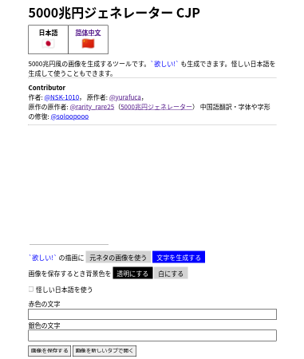

# 5000choyen
5000兆円風の文字を描画するWebツールです。怪しい日本語も使えます。

[ここ!](https://nsk-1010.github.io/5000choyen)



# APIの使い方
APIが使えます。

```
https://nsk-1010.github.io/5000choyen/api.html?top=上部文字列&bottom=下部文字列&correctjp=yesまたはno
```

|name|value|description|
|-----------|--------------|-----------------|
|`top`|-|上部文字列|
|`bottom`|-|下部文字列|
|`bx`|-|下部の左の空白(単位はpx)|
|`hoshii`|`true`/`false`|下部文字列を「欲しい！」に固定する|
|`alpha`|`true`/`false`|背景色を透明にする|
|`correctjp`|`yes`/`no`|怪しい日本語を使う|